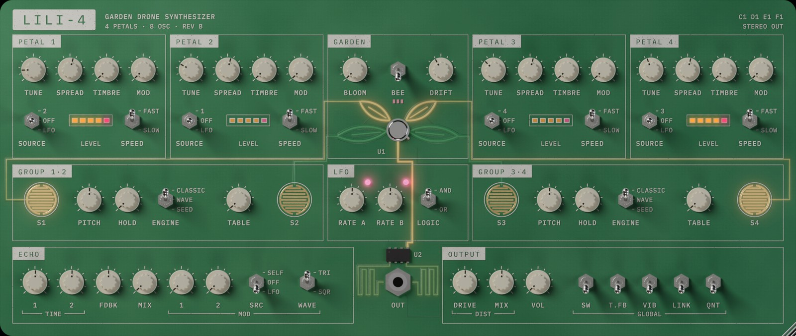

# LILI-4

A four-petal garden drone synthesizer for macOS: AU, VST3 and a standalone app, built universal for Apple Silicon and Intel.



## The instrument

- **Four petals, two oscillators each**, grouped 1·2 and 3·4. Each petal has:
  - **TUNE**: C1–C7.
  - **SPREAD**: the offset of its second oscillator, from a fine detune at the centre to ±1 octave at the ends.
  - **TIMBRE**, **MOD** and **SOURCE**: FM from the partner petal, or from the LFOs and total feedback.
  - **SPEED**: a fast or slow swell.
- **ENGINE**, set per group:
  - **Classic**: pulse and triangle.
  - **Wave**: four procedural wavetable families (Stem, Reed, Glass, Moss), scanned by **TABLE**.
  - **Seed**: a granular sampler. Drop an audio file on the board to load one.

  TIMBRE sets the pulse shape, the wavetable morph or the position in the sample, depending on the engine.
- **BLOOM / DRIFT**: slow generative growth. Petals breathe awake without notes and wander in tune and timbre, over cycles from minutes down to seconds.
- **BEE**: the Pollinator, a Lorenz-attractor modulator that replaces the LFO pair. **RATE A** sets its flight speed and **RATE B** its chaos.
- **ECHO**: two modulated delay lines, feeding **DRIVE**.
- **Stereo or mono out.** In stereo, the petals sit left and right as they do on the board, and the two echo lines cross between the channels. The bass stays centred, so the mix folds down to mono cleanly. Mono is the original single-channel output.
- **Rendered circuit-board UI.** The board is rendered in Blender and composited natively. Knobs and toggles are drawn at their live values, and the traces, pads, LEDs and meters glow with the actual audio. The window is 1000×424 by default; drag its corner to resize it from 700 to 2000 wide.

## Installing

Download the zips from the [latest release](https://github.com/kristianfreeman/lili-4/releases/latest). They are universal builds for Apple Silicon and Intel, macOS 11 or later.

- **AU:** unzip `LILI-4.component` into `~/Library/Audio/Plug-Ins/Components`.
- **VST3:** unzip `LILI-4.vst3` into `~/Library/Audio/Plug-Ins/VST3`.
- **Standalone:** unzip `LILI-4.app` into `Applications`.

The builds are not notarized, so macOS may block them the first time. Right-click the app and choose **Open**, or remove the quarantine flag with `xattr -dr com.apple.quarantine <path>`.

## Playing it

MIDI notes **C1, D1, E1, F1** (36, 38, 40, 41) play petals 1–4. **HOLD** makes a group drone continuously.

On the board:

- **Knobs:** drag up or down (hold Shift for fine control). Double-click to reset, or use the scroll wheel.
- **Toggles:** click to throw. On 3-way toggles, click above or below the pivot.
- **Petal pads** (S1–S4, in the group boxes): click to latch a petal on.
- **MONO OUT / STEREO OUT** (top right): click the label to switch the output between mono and stereo.
- **Hover** over any control to see its value in real units.
- **Drop an audio file** on the left or right half of the board to load a Seed sample for group 1·2 or 3·4.

Every control is a host parameter, so MIDI mapping and automation work on all of them.

## Building

You need CMake 3.25 or newer, and Xcode on macOS. JUCE is fetched at configure time. To use a local copy, pass `-DLILI_JUCE_DIR=/path/to/JUCE`.

```sh
cmake -S . -B build -DCMAKE_BUILD_TYPE=Release "-DCMAKE_OSX_ARCHITECTURES=arm64;x86_64"
cmake --build build --parallel
ctest --test-dir build --output-on-failure
```

Configure with `-DLILI_COPY_PLUGIN=ON` to install the AU and VST3 into `~/Library/Audio/Plug-Ins` after each build. For an engine-only build, without JUCE, use `-DLILI_BUILD_PLUGIN=OFF`.

## Layout

| Path                  | What                                                        |
|-----------------------|-------------------------------------------------------------|
| `dsp/`                | Framework-free engine (`lili::Engine`)                      |
| `plugin/`             | JUCE wrapper: parameters, MIDI, state and the board editor   |
| `tests/`              | Unit tests, an offline WAV renderer and a benchmark         |
| `docs/SPEC.md`        | The signal flow, written out as math                        |
| `art/`, `tools/art/`  | Board layout, fonts, and the Blender render pipeline        |
| `plugin/assets/`      | UI art embedded in the plugin                               |

## References

- **[SOMA Laboratory Lyra-8](https://somasynths.com/lyra-8/)**: the organismic drone synthesizer by Vlad Kreimer that inspired all of this.
- **[LIRA•8](https://github.com/MikeMorenoDSP/LIRA-8)** by Mike Moreno: a Pure Data emulation of the Lyra-8. LILI-4's engine began as a native port of it.

LILI-4 is an independent project and is not affiliated with SOMA Laboratory or Mike Moreno DSP.

## License

BSD 3-Clause, see [`LICENSE`](LICENSE). The LIRA•8 notice (© Miguel Moreno, BSD) is kept in `LICENSE`. The fonts in `art/fonts/` are under the SIL Open Font License.
